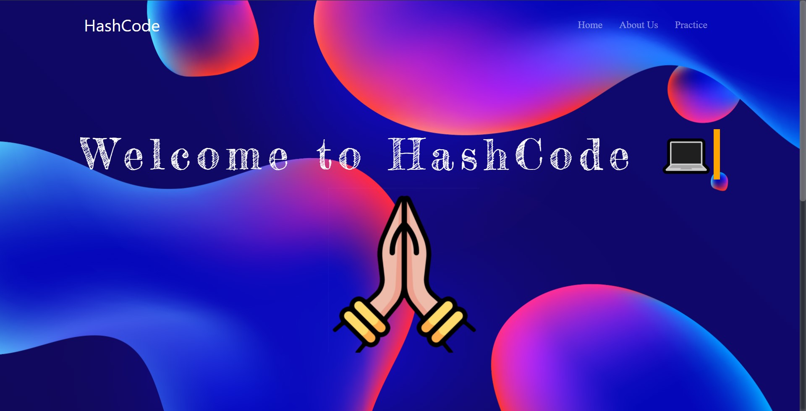
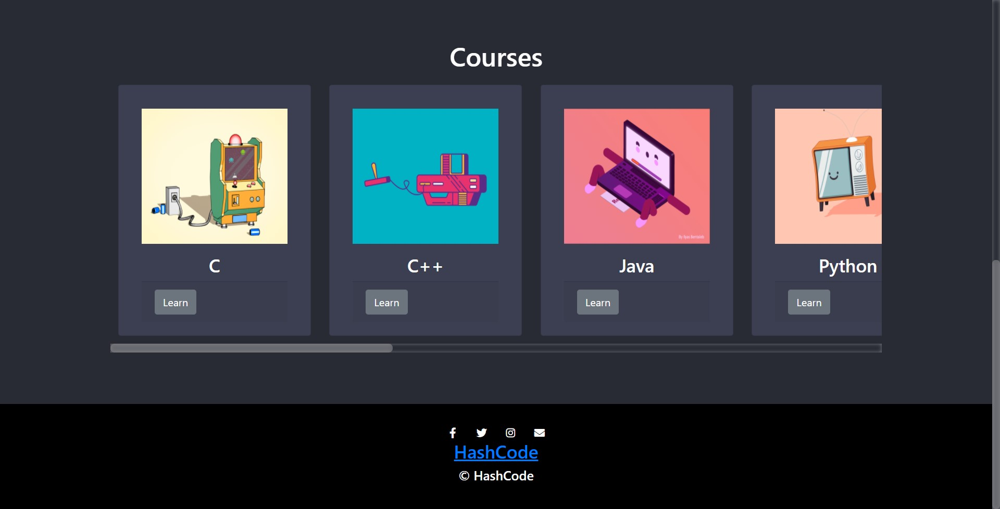
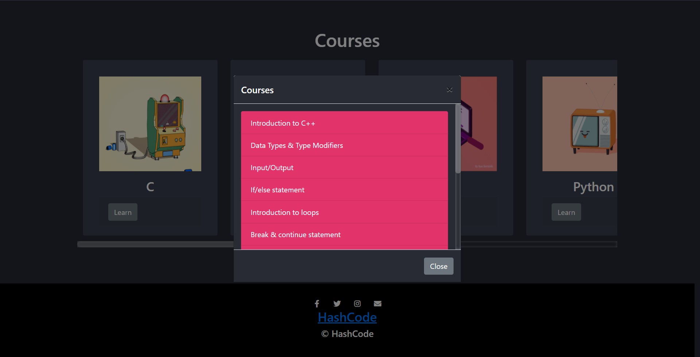

<p align="center">
    <a href="#"></a>
    <h2 align="center">discover best courses for the best  learning</h2>
</p>


<p align="center">
    </a>
    </a>
    </a>
</p>


## Chat with us
[](https://gitter.im/inaxia-group/hashcode-web?utm_source=badge&utm_medium=badge&utm_campaign=pr-badge)


## Description
We got the inspiration of this idea with the help of our fellow friends who wanted to have good knowledge as well as relevant skills in different **Programming languages** and **frameworks**. They wanted a single platform to access the **best resources** available in the internet, so we came up with an idea to build this platform.

**HashCode** is a web and app based platform where the we provide the **best-handpicked courses** from the internet at one place of different branches. Students who will use the platform can view **various courses** and test their knowledge.

[](https://github.com/inaxia/hashcode_web/stargazers)
[](https://github.com/inaxia/hashcode_web/network)
[](https://github.com/inaxia/hashcode_web/issues)

## Installation
**You need to do changes only in `develop` branch**<br>
(Make sure you have **Node/Nodemon** & **Express** installed)
1. Fork this repo
2. Clone the forked repo
3. Open the main/parent `hashcode_web` folder
4. Run the following command inside `hashcode_web`'s terminal:
    - `node app.js` -> if you have **Node**
    - `nodemon app.js` -> if you have **Nodemon**
    - You'll get a port_number
5. Open any browser, in new tab enter a url `https://localhost:<port_number>/` like `http://localhost:3000/`


## Visual
<br>
<br>
<br>


## Community
**[Code of Conduct](https://github.com/inaxia/attendance_using_face_recognition/blob/master/CODE_OF_CONDUCT.md)**<br>
**[Contributing to Inaxia](https://github.com/inaxia/attendance_using_face_recognition/blob/master/CONTRIBUTING.md)**


## License
```
MIT License

Copyright (c) 2020 inaxia

Permission is hereby granted, free of charge, to any person obtaining a copy
of this software and associated documentation files (the "Software"), to deal
in the Software without restriction, including without limitation the rights
to use, copy, modify, merge, publish, distribute, sublicense, and/or sell
copies of the Software, and to permit persons to whom the Software is
furnished to do so, subject to the following conditions:

The above copyright notice and this permission notice shall be included in all
copies or substantial portions of the Software.

THE SOFTWARE IS PROVIDED "AS IS", WITHOUT WARRANTY OF ANY KIND, EXPRESS OR
IMPLIED, INCLUDING BUT NOT LIMITED TO THE WARRANTIES OF MERCHANTABILITY,
FITNESS FOR A PARTICULAR PURPOSE AND NONINFRINGEMENT. IN NO EVENT SHALL THE
AUTHORS OR COPYRIGHT HOLDERS BE LIABLE FOR ANY CLAIM, DAMAGES OR OTHER
LIABILITY, WHETHER IN AN ACTION OF CONTRACT, TORT OR OTHERWISE, ARISING FROM,
OUT OF OR IN CONNECTION WITH THE SOFTWARE OR THE USE OR OTHER DEALINGS IN THE
SOFTWARE.
```


## Support
<br>
**If you like our project, don't forget to give it a ⭐**
